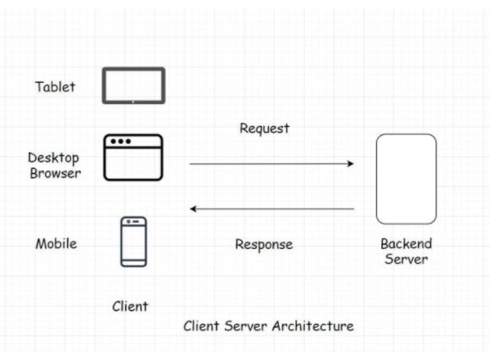
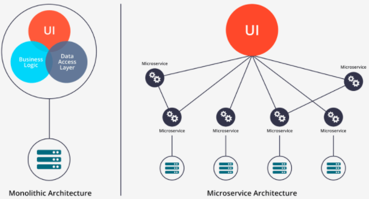
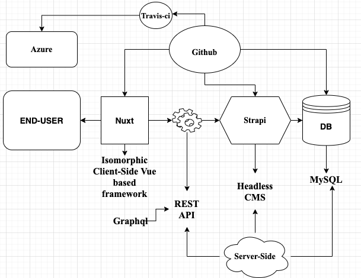

# Specifications For Project Lifecycle Web Application

1. Objectifs de l’application.
2. Spécificités techniques de l’application.
3. Stack pour le developpement et la mise en production de l'application.
4. Délais de réalisation de l’application.

## Objectifs de L'application

Le principal produit de ce projet sera le développement d’une application web dédiée aux acteurs du développement et donc qui priorise la méthodologie waterfall et offre une pluralité de fonctionnalités répondants aux besoins des programmes et projets de développement dont le travail collaboratif. Le produit devra fusionner au mieux les avantages des logiciels desktop waterfall et des applications mobiles et web Agile, Kanban et Scrum orientées affaires.

L'application devra:

- Fournir aux professionnels en gestion de projet un outil informatique complet et convivial susceptible de faciliter leurs travaux de planification et de gestion de la mise en œuvre de leur projet.

- Fournir aux équipes de projet un espace de travail collaboratif et simultané sur un même document ou sur plusieurs documents, leur permettant ainsi de gagner du temps dans la réalisation de leur projet.

- Fournir aux équipes de projet un espace de stockage sécurisé et accessible sur n’importe quel appareil pour stocker les documents techniques et administratifs.

- Créer une entreprise technologique performante capable d’offrir l’application à un maximum de professionnels du développement et de les accompagner quotidiennement dans l’utilisation de cette dernière.

## Specificites Techniques de L'application

Dans cette section, nous aurons a aborder en detail les fonctionnalites des differentes composantes de l'application.

### L'arborescence de l'application

Par arborescence de l'application, on entend un graphe donnant une representation static des composantes de l'interface d'utilisateur. Et on pourra voir comment ces composantes sont interconnectes.

Il peut etre presente en annexe

> Decision:

Nous choisissons d'utiliser le logiciel [Figma](https://www.figma.com). Il est "web-based" et l'apprentissage n'est pas aussi difficile.

Nous pouvons utiliser un logiciel "web-based" [draw.io](https://app.diagrams.net)

figma nous permettra de faire un design du UI. Il faudra prendre soin du meme coup se familiariser avec les bonnes pratiques UI/UX. `$courses :design.probs`

draw.io est assez intuitif. Nous pourrons l'utiliser pour faire des diagrams simple represantant au mieux l'application.

### Fonctionnalite de l'application

Cette section sera l'objet des fonctionnalites retenus pour l'application.

## Stack Pour le developpement et la mise en production de l'application

Le mot "Stack" designe, en ce qui nous concerne, l'ensemble des technologies que nous allons utilise pour developper l'application. Par technologies, nous entendons les languages de programmations et les services que nous aurons a employer.

Toutefois nous utiliserons ce terme pour englober le modus operandi c'est-a-dire l'infrastructure (l'architecture) que nous mettrons en place pour batir l'application.

Notre objectif est de trouver la meilleur facon de construire l'application web pour fournir une excellente performance, avec un haut niveau de securite et un cout raisonnablement bas pour le `scaling`.

### Les Questions D'infrastructures Generales

Par Software Architecture nous entendons la representation et la coordination des composantes principales du systeme, qui vont constituer ensemble l'application. Il est necessaire d'aborder ce point puisque le choix de l'architecture determinera l'evolution, la performance et la resilience de l'application.

A la base, l'architecture qui est la plus principalement utilisee pour repondre aux besoins d'un utilisateur, est l'architecture `Client-Server`. Il est base sur model `response-resquest`.

En resume, l'utilisateur en operant sur l'interface utilisateur fait des requettes. Ces requettes devront etre repondues par des services. Ces services sont offerts par un server ou plusieurs microservices. Bien evidemment la question de persitence des donnees du client est automatique dans ce scenario. Fort de cela, nous avons deux choix qui vont faire surface. Il existe deux architectures de la meme famille que l'architecture `Client-Server`. L'architecture `Monolithic` et l'architecture `Microservices`.

Sans trop entrer dans les details techniques, la question est de savoir lequel des deux choisirs? Ou du moins par quoi commencer? Les applications monolithics sont adequat si les specificites sont simples. Et si le traffic est reduit. Par-contre, immediatement que ces deux balises sont sautees. Il va falloir pivoter sur une autre architecture. A ce moment on pourra passer dans une architecture microservice. A ce sujet, on pourra prendre l'exemple de [linkedin](https://engineering.linkedin.com/architecture/brief-history-scaling-linkedin).

### L'infrastructure d'une iteration de notre Minimal Viable Product

Apres ce rapide mise au point, nous allons maintenant aborder la question des decisions d'infrastures que nous pourrons retenir pour notre M.V.P. Il faut toutefois preciser que l'M.V.P est possible une fois que nous aurrons arreter les differentes fonctionnalites qu'il devra contenir.

De ce faite, nous avons fait le choix de cette architecture minimaliste type monolithic. Cependant le fait que nous adoptons le choix d'un `headless cms` pour fournir les services vers un `isomorphic framework` pour le Client-Side, va nous permettre de pivoter plus surement vers un architecture microservice a l'avenir.

Nous avons plusieurs scenarios possibles:

1. Nuxt, un service RESTAPI ou Graphql `<Strapi>`, Strapi, MySQL pour la persistence `<Strapi>`, repository sur Github, un pipepline CI/CD fourni par travis-ci et le hosting fourni par les services azure.

2. On pourrait remplacer Nuxtjs par Nextjs. Il est base sur React.

3. On pourrait remplacer strapi par un headless cms venant de php.

4. On pourrait choisir d'utiliser un autre DB. On pourrait choisir MongoDB.

5. On pourrait faire le choix de d'ecrire le server/API avec Graphql au lieu d'implementer le RESTAPI.

6. On pourrait Choisir un autre repository autre que github. On pourrait choisir gitlab ou bien bitbucket.

7. On pourrait ce servir d'un autre service CI/CD tel que circle-ci. Ou bien de ne pas s'en servir du tout.

### Les differentes Composantes technologiques retenus

Cette sous-section fait l'objet d'un exposee des differents technologies qui seront utilisees. Nous ne pourrons pas aborder toutes ces thematiques en profondeur. Mais elles sont fondamentales pour l'execution du projet.

1. La base: `<C>`

   - Html5
   - Vanilla CSS
   - Vanilla Javascrit

Ce sont la, les elements primaires du developpement logiciel. Ils devront faire l'objet d'une maitrise certaine.

2. Un framework CSS ou design system: `one more`

   - Sass
   - Bulma
   - Tailwind
   - Boostrap
   - material design `<C>`

3. Vers Headless CMS: `<C>`

   - Node
   - Express
   - Strapi
   - REST ou GraphQL

Strapi est contruit au-dessus de Nodejs. Il serait bien d'avoir une notion et une experience complete avec node et express. Comment etablir un server RESTAPI ou Graphql? Comment etablir une connection securise avec un database choisi. Et consort. Pour tout autre headless cms choisi, un raisonnement analogue sera fait au cas par cas.

4. Database managment system: `C`

   - MySQL / PostgresSQL
   - MongoDB / CoucheDB `(mention: Redis)`

5. Vers Nuxt ou Next `<C>`

   - SPA: React ou Vue
   - State: Redux ou Vuex
   - Next ou Nuxt

Dans ce context, on ne pourra utiliser de `JAMstack` certe. Mais il faut garder a l'esprit que Next et Nuxt peuvent faire du `Static Site Generation`. De plus, nous avons corriger les defauts trouver au niveau des SPA, tel que des problemes lies au moteur de recherche.

6. DevOps

   - ci/cd: Travis-CI ou Circle-CI
   - Virtualisation: Docker ou Kubernetes
   - Hosting plateforme: Netlify, Azure, AWS et Heroku `<C>`

Nous avons le choix d'utiliser ou pas un service CI/CD, de virtualisation. Mais a la longue ce seront des options viables.On pourrait dans l'immediat rechercher des services d'hostings gratuits. Mais a un moment de la duree, on va devoir passer a un service de plus haut calibre. Donc Payant.

7. Version Control System `<C>`

   - Git
   - Github / Gitlab

> Decision:

Les Composantes technologiques devant permettre a la construction du MVP va demander un certain temps d'apprentissage.

Il faut toutefois preciser qu'il ne s'agira pas de maitriser en profondeur les differents points soulever. Mais par-contre il y en a certaines qui sont capitales.

Software Architecture `$course :product.manger/scrumMaster/product.owner`

## Delai de realisation de l'application
